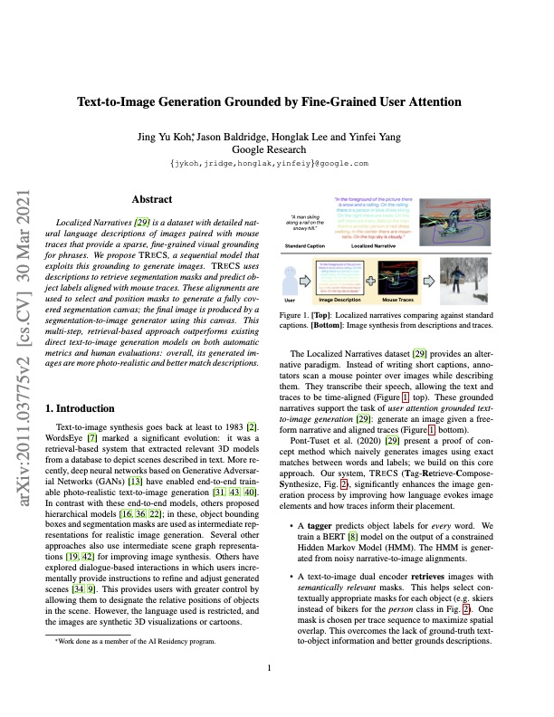
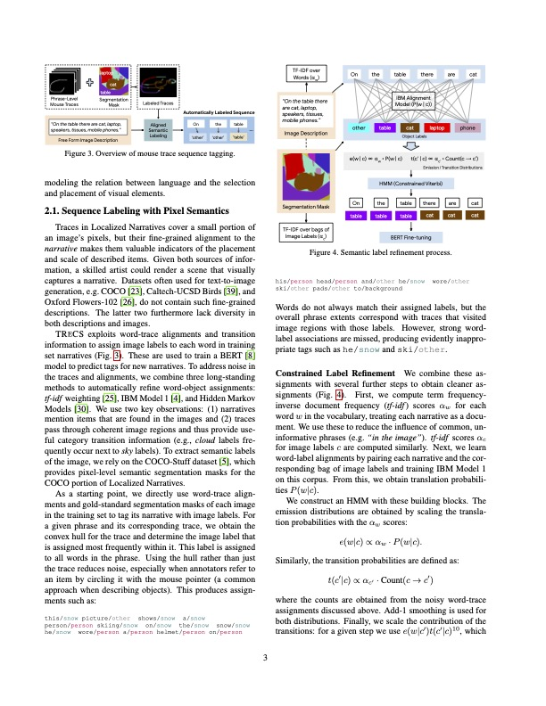

 

  
  
  
  

  <h3 align="center">Sequence Tagging</h3>

  

    Text to Image Generation Grounded by Fine-Grained User Attention (Jing Yu Koh et. al) Implemention of Sequence Labeling with Pixel Semantics, Section 2.1
  

## Questions
- How to deal with P(w|None) from IBMModel1?
- Why use IBMModel1 when we already have the alignments between words and labels
- How did the authors initialize the start probablities in the HMM
- How may I use Add-1 smoothing with IBMModel1 from nltk

## TODOs (as of 23 Aug 2021)
- [ ] Use Add-1 smoothing on translation probabilities
- [ ] Align transmission and emission matrices by label
- [ ] Modify Viterbi to allow constraints and scaled contributions of transition probabilities
- [ ] Auto-Supervised Training on BERT model to perform tagging

## References 
- Localized Narratives - https://github.com/google/localized-narratives/blob/master/demo.py
- ADE20k - https://groups.csail.mit.edu/vision/datasets/ADE20K/
- tf-idf - https://towardsdatascience.com/natural-language-processing-feature-engineering-using-tf-idf-e8b9d00e7e76
- Viterbi - https://stackoverflow.com/questions/9729968/python-implementation-of-viterbi-algorithm/9730083
- points within hull - https://stackoverflow.com/questions/21339448/how-to-get-list-of-points-inside-a-polygon-in-python
